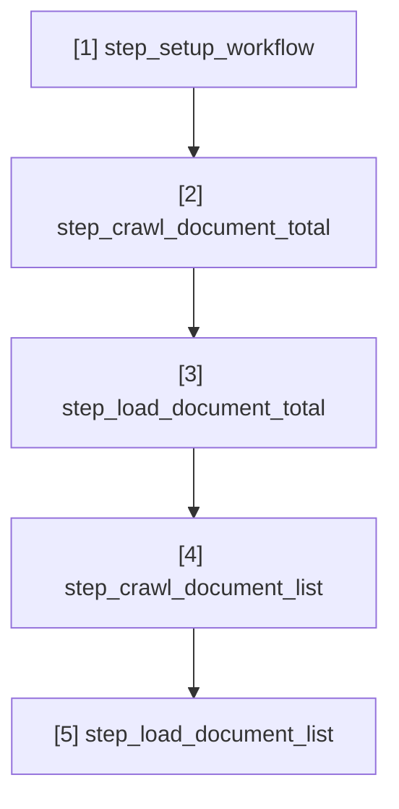

# Sơ đồ

```mermaid
flowchart TD
    N1["[1] step_setup_workflow"]
    N2["[2] step_crawl_document_total"]
    N3["[3] step_load_document_total"]
    N4["[4] step_crawl_document_list"]
    N5["[5] step_load_document_list"]

    %% Các liên kết
    N1 --> N2
    N2 --> N3
    N3 --> N4
    N4 --> N5
```
